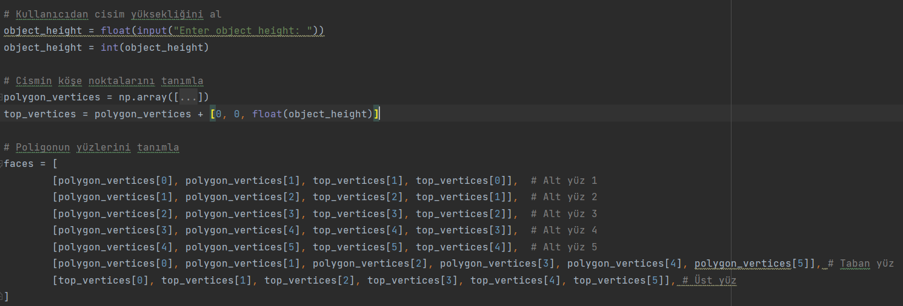
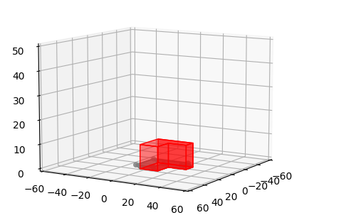
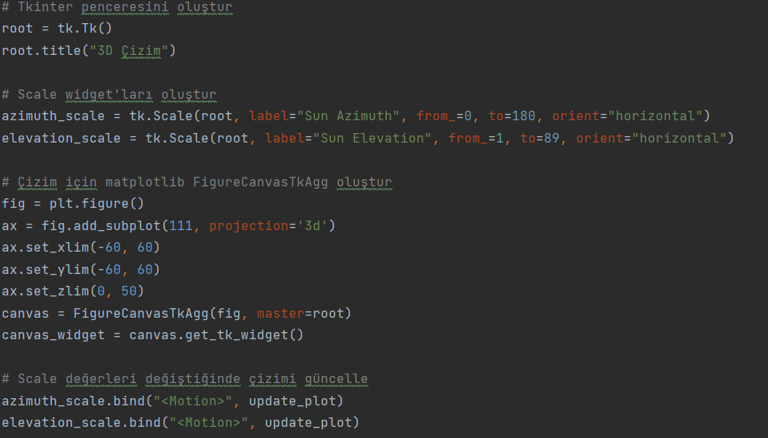
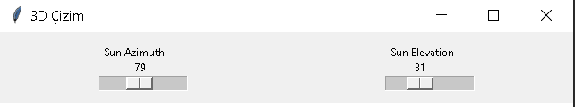
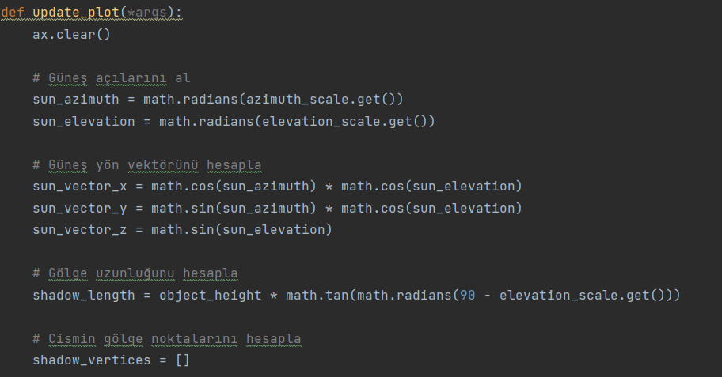

# Intership Project

## The aim of the project is to draw the shadow of the given polygon according to the positon of the sun.
1) It draws a ceratin polygon with points on the plot created with matplotlib and turns this polygon into a 3-dimensional object with the object height requested by the user.
 
2) 2)An interface is created via tkinter library.Then 2 scales are used in this interface.Scaller is there for the user to set the sun_Azimuth and sun_elevation values. With these values received from the user,sun_positon is determined.
 
3) It also draws  the plot created with matplotlib to the interface. It draws and updates the shadow on the plot with the update_plot() function in the code according to the values received from the scaler.
  

https://github.com/serapcengiz/stajProject/assets/73667009/49596a3d-b071-4326-8a05-134d7c524886

### Requests Library
`pip install matplotlib`    
`pip install numpy`   
`pip install tkinter`  
